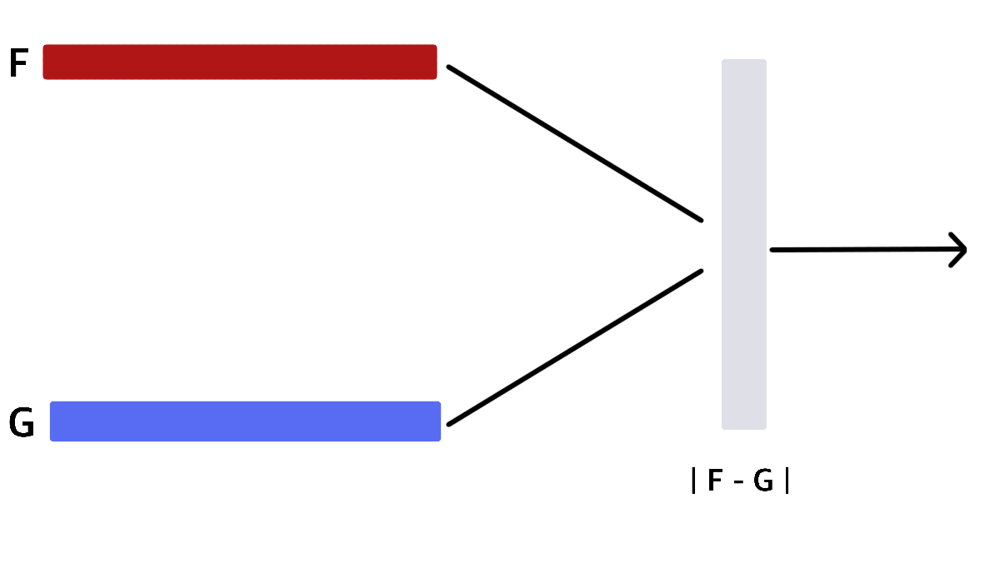

# siamese_network
This notebook discusses a simple implementation of siamese architecture using pytorch.

#### Siamese architecture
We will use a simple convolitional model to encode our input image into vectors and calculate the similarity between different encodings to verify users. The task is to learn these embeddinds or vectors from images such that similar images have similar encodings/vectors and vice versa. We will try to learn these embeddings with a simese network architecture as shown in the image below. The $F,G$ are the same models called twice to convert and anchor image and an input image (positive/negative) and calculate the absolute difference between the outputs (L1 Norm).

L
1
=
|
F
−
G
|

The output of this siamese network is fed to a sigmoid unit to predict the probability of the images being the same.

#### Loss Graph over 30 epochs

